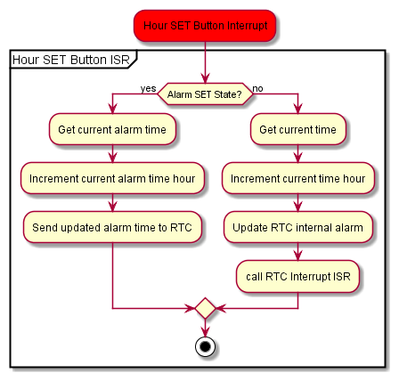

<Desc.>

#### A full detailing can be found [here](www.markhofmeister.com/) 

## Directory Structure 

## System Diagram

## Flowcharts
### Main Thread
 
### Interrupts
<!---

-->
 
 
 
 
 
 
 

## Exploded Mechanical View
	

